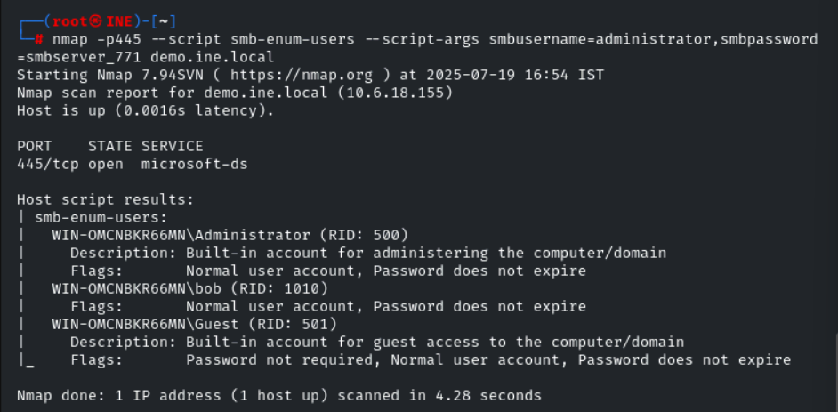
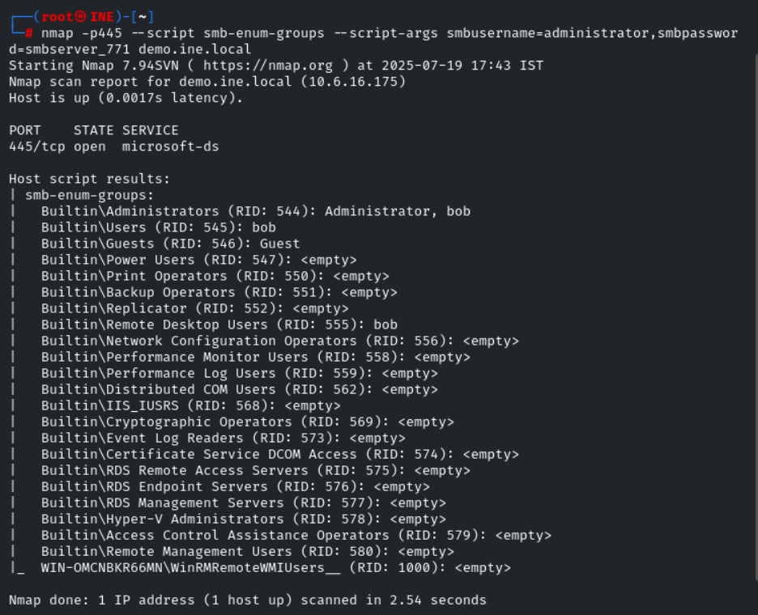
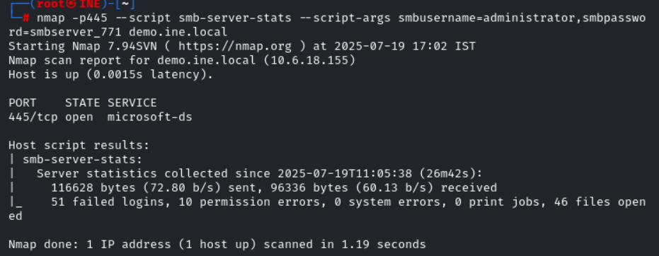
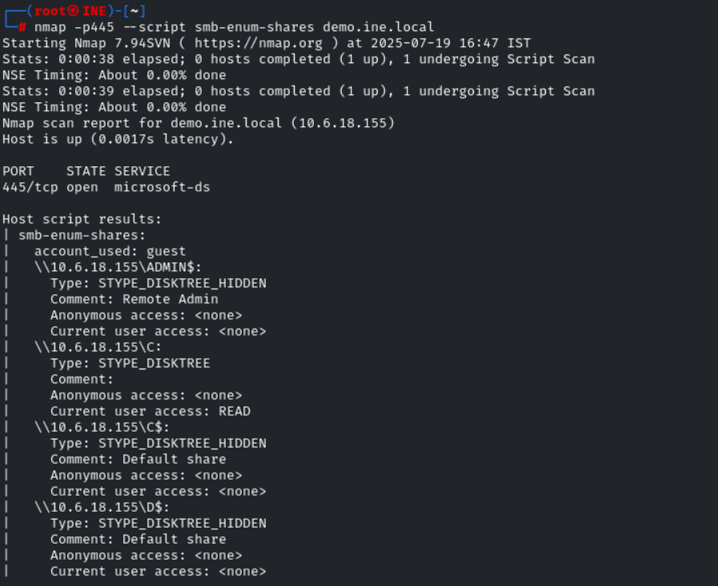

# 🧪 Lab 02 – Samba Recon: Basics


## 🎯 الهدف من اللاب
معرفة بروتوكول SMB وكيفية:
- فحص البورتات
- فحص إعدادات الأمان الخاصة بـ SMB
- معرفة الـ Users والملفات الموجودة على السيرفر
- الدخول بيوزر حقيقي
- معرفة الـ Sessions التي تعمل حاليًا
- معرفة إحصائيات السيرفر (عدد الملفات المفتوحة، محاولات الدخول الفاشلة...إلخ)

---

 إيه هو SMB؟

الـ **SMB** هو بروتوكول بيستخدم داخل الشبكة، بيمكن الأجهزة إنها تقدر تشارك ملفات أو طابعات أو فولدرات بين الأجهزة، وتمكن إن الأجهزة التانية تقدر توصل للحاجات دي على جهاز معين مشغّل عنده خدمة SMB.

 مثال واقعي:

تخيل إن في شركة، وعندهم سيرفر عليه ملفات HR مثلًا.  
فـ مسؤول IT يعمل **Share Folder** فيه الملفات دي، ويخلي الموظفين يقدروا يوصلوا ليه من أجهزة تانية على الشبكة.  
اللي بيخلي ده يشتغل هو بروتوكول SMB.


 كـ Pentester

لو الجهاز عليه خدمة SMB (يعني البورت 445 مفتوح)، ده معناه احتمال كبير يكون في:

- فولدرات متشاركة
- مستخدمين مفيش عليهم صلاحيات كويسة
- ملفات ممكن توصل لها بدون Password
- أو حتى ثغرات في نسخة SMB اللي شغالة

---


 1️⃣ فحص البورت 445 ومعرفة البروتوكولات المدعومة
 
في البداية بدأت أجمع معلومات عن البورتات المفتوحة باستخدام Nmap.  
ولما لقيت إن بورت 445 مفتوح (وده البورت الخاص ببروتوكول SMB) قررت أستخدم سكريبت من الـ Nmap Scripting Engine علشان أعرف البروتوكولات والنسخ اللي الخدمة بتدعمها.

```
nmap -p 445 --script smb-protocols <target>
```

📌 النتيجة:  
الخدمة بتدعم [SMBv1, SMBv2, SMBv3] ← وده مهم جدًا لأن بعض الإصدارات القديمة (زي SMBv1) فيها ثغرات خطيرة زي **EternalBlue**

✅ يعني إيه بيدعم الـ 3 إصدارات؟  
ده معناه ان الجهاز اللي شغال عليه الخدمه بيقولك انا بدعم ال 3 اصدارات دول فانا مستعد اكلم اي جهاز عنده اي اصدار من دول يعني لو جهازك بيطلب اتصال ب v1 هيوافق لو ب v3 هيوافق


❌ المشكلة:  
SMBv1 
قديم جدًا وفيه ثغرات خطيرة زي **EternalBlue**، واللي اتسببت في اختراقات ضخمة زي فيروس **WannaCry** اللي شفر ملفات أجهزة كتير وطلب فدية.

📌 اي هي ثغره ال EternalBlue ؟
ال v1 من smb عنده ثغره بتخلي الاتاكر يعمل remote code execution انهم يشغلوا كود عن بعد علي الماشيين اللي البروتوكول شغال عليها والاتاكر استغلوا ده واخترقوا الاجهزه اللي مش عامله patch ونزلوا عليها فيروس الفديه **WannaCry** انهم يشفروا الملفات ويطلبوا فديه عشان يرجعوا الملفات الهجوم انتشر بسرعة رهيبة في الشبكات لأن الـ **SMB** بيكون مفعّل افتراضيًا في نسخ الويندوز القديمة.


---

 2️⃣ فحص إعدادات الأمان في SMB

عاوزين نعرف اي اخبار الامان الخاص بالخدمه بتاع ال smb اللي شغاله علي الجهاز ده  فاستخدمنا الاسكريبت التاني ده 

```
nmap -p445 --script smb-security-mode <target>
```

📌 النتائج:

- بيقبل اتصال بدون يوزر نيم وباسورد

- بيستخدم **user-level authentication** (مش share-level) وده معناه انه عشان يخش علي الحاجات اللي معمول ليها شير بيخش بيوز وباسورد وده عكس ال share level اللي بيخليك تخش علي الملفات بباسورد فقط مفيش يوزر

- بيدعم challenge-response وهو ان السيرفر  تحدي بيتحل بالباسورد فانت تحل وتبعت  والسيرفر يشوف الرد بتاعك هل صح ولا لا وبناء علي ده يدخلك او يمنعك وده  بيحمي الباسورد من انه يتسرب بسهوله

- ❌ لا يدعم message signing ← يعني الاتصال غير مؤمَّن ضد التلاعب والـ MITM وتوقيع الرسائل يعني كل رساله معديه بين جهازك والسيرفر موقعه عشان لو حد حاول يغير فيها المستلم يكتشف ده فدلوقتي انت مش بتدعم ده فده خطر ان اي حد ممكن يتدخل في الاتصال ويعدل في البيانات ويكون ك man in the middle ودي حاجة خطيرة في بيئة فيها أكثر من جهاز


---


3️⃣ مين اليوزر اللي شغال دلوقتي؟ (Enumerate Sessions)

استخدمنا اسكريبت بيحاول يجيبلك **مين شغال دلوقتي (logged in)** على السيرفر اللي بيشغل خدمة SMB 

```
nmap -p445 --script smb-enum-sessions demo.ine.local
```

📌 النتيجة:  
فيه يوزر اسمه `bob` شغال على السيرفر WIN-OMCNBKR66MN 
والمعلومة دي ظهرت لأن السيرفر مفعل خاصية الـ **Guest** فقدرت اخش علي السيرفر بدون يوزنيم او باسورد

ممكن كمهاجم تستخدم اسم اليوزر في Brute-force attack


---

 4️⃣ الدخول بيوزر حقيقي ومعرفة الجلسات:
 استخدمت باسورد ويوزر حقيقين عشان اقدر اعرف المعلومات اللي مصرح ليا من السيرفر اني اعرفها كيوزر معين 

```
nmap -p445 --script smb-enum-sessions --script-args smbusername=administrator,smbpassword=smbserver_771 demo.ine.local
```

📌 ده بيشتغل زي ما تدخل مكتبة:

- من غير بطاقة (Guest): تشوف الناس من بعيد
- ببطاقة (يوزر وباسورد): تسأل وتاخد أسماء الناس اللي موجودة
    

---


 5️⃣ معرفة الملفات اللي معمولة ليها شير:
 
  استخدمت اسكريبت كمان عشان اقدر اطلع الملفات اللي معمول ليها شير علي السيرفر وعرفت اسم كل share ونوعه مخفي ولا ظاهر وهل هقدر اوصله ك guest ولا لا واي نوع الصلاحيات اللي عندك عليه حاليا كضيف واقدر اخش مثلا ادور في الملفات اللي مسموح اقراها يمكن الاقي معلومات حساسه مثلا

```
nmap -p445 --script smb-enum-shares demo.ine.local
```

📌 النتيجة:  
لقينا الملف `IPC$` ← وده القناة اللي البرامج بتعدي منها علشان تتكلم مع السيرفر.  
**مش علشان تدخل فولدرات، لكن علشان تبعت وتستقبل أوامر ومعلومات.**
زي  الاسكريبت `smb-enum-shares` أو `smb-enum-sessions` أو أي أداة SMB بيحاولوا يجيبوا معلومات من السيرفر، مش بيخشوا على فولدرات مباشر بل بيكلموا السيرفر من خلال القناه المخصصه للتواصل اللي هي IPC


مثال عملي:

- لما تسأل السيرفر: "إيه الفولدرات اللي معمول لها share؟"
- أو "مين اليوزر اللي عامل login دلوقتي؟"

السكريبت بيستخدم الـ `IPC$` علشان:

- يتصل بالسيرفر
- يطلب منه يبعته البيانات دي
- السيرفر يرد عليه من خلالها


فلو السيرفر سامح لاي حد يوصل بدون صلاحيات ممكن الهاكر يستخدم ال IPC عشان يجمع معلومات كتير عن السيرفر بدون ما يسجل دخول حقيقي 


---


 6️⃣ فحص الـ shares مرة تانية ولكن بـ user و password هل ده هيختلف عن اني اخش من غير يوزر ولا باسورد؟ اكيد هيختلف لان مش هيكون صلاحيات اليوزر زي صلاحيات ال guest ولما فعلا جربت الاسكريبت ده مع اليوزر نيم والباسورد طلع ان اليوزر ده ليه صلاحيات اكتر مش زي صلاحيات ال guest 

```
nmap -p445 --script smb-enum-shares --script-args smbusername=administrator,smbpassword=smbserver_771 demo.ine.local
```

📌 النتيجة:  
اليوزر ده ليه صلاحيات أكتر من الـ Guest.


---

7️⃣ فحص اليوزرات الموجودة على السيرفر:

```
nmap -p445 --script smb-enum-users --script-args smbusername=administrator,smbpassword=smbserver_771 demo.ine.local
```

📌 الفرق؟  
وأنا Guest ظهر يوزر واحد.  
وأنا Administrator ظهر يوزرات أكتر.


---

 8️⃣ معرفة إحصائيات السيرفر:

```
nmap -p445 --script smb-server-stats --script-args smbusername=administrator,smbpassword=smbserver_771 demo.ine.local
```

📌 بيعرفك:

- عدد الملفات المفتوحة حاليًا
- عدد محاولات الدخول الفاشلة
- الطابعات المشاركة
- محاولات غير مصرح بها


---

 9️⃣ هل السيرفر تحت Domain ولا Workgroup؟

مكن الجهاز يكون تحت domain  وال domain في SMB/Windows يعني مجموعه من الاجهزه سواء pc او servers بتدار مركزيا عن طريق Domain controller زي Active directory كده فكل جهاز او يوز بيتسجل تحت ال domain ده 

او ممكن يكون في workgroup وده ان كل الاجهزه في شبكه محليه لكن كل جهاز مسئول عن نفسه واليوزر نيم مفيش إدارة مركزية والباسورد لازم يكونوا موجودين محليا علي الجهاز يعني لو جهاز معين عليه يوزر نيم وباسورد وهو عامل شير وانا جهاز تاني معايا اليوزر والباسورد بتوعه وعاوز اخش علي الشير بتاعه لازم هو اللي يسمح ليا وكمان مفيش سياسات مثلا مطبقه علي مجموعه من الاجهزه مره واحده

فاستخدمنا اسكريت بيحاول يتواصل مع ال smb علي بورت 445 باستخدام اليوزر والباسورد اللي اديتهوله، بيطلب من السيرفر يطلّع له: إسم الـ **Domain أو Workgroup** اللي السيرفر عضو فيه. 


```
nmap -p445 --script smb-enum-domains --script-args smbusername=administrator,smbpassword=smbserver_771 demo.ine.local
```

📌 بيجاوبك السيرفر:  
هو تابع لـ Domain مركزي؟ ولا مجرد Workgroup محلي؟  
مهم جدًا في بيئات الشركات!


---

 🔟 معرفة كل الجروبات على السيرفر:
 
 استخدمنا اسكريبت يطلع ليا كل الجروبات بتاع اليوزرس اللي معموله علي السيرفر 

```
nmap -p445 --script smb-enum-groups --script-args smbusername=administrator,smbpassword=smbserver_771 demo.ine.local
```


 🔚 أخيرًا: عرض كل الملفات والفولدرات في الـ shares

```
nmap -p445 --script smb-enum-shares,smb-ls --script-args smbusername=administrator,smbpassword=smbserver_771 demo.ine.local
```

---

🎯 **خلاصة سريعة**:

- بورت 445 يعني فيه SMB شغّال
    
- SMBv1 = خطر كبير
- Nmap سكريبتات قوية جدًا في الـ Enumeration
    
- الـ IPC$ مهم لجمع المعلومات
- صلاحيات الـ Guest مختلفة عن اليوزر الحقيقي
- السيرفر ممكن يكشف كتير لو مش مؤمَّن كويس
---
## 📸 Screenshots











    

